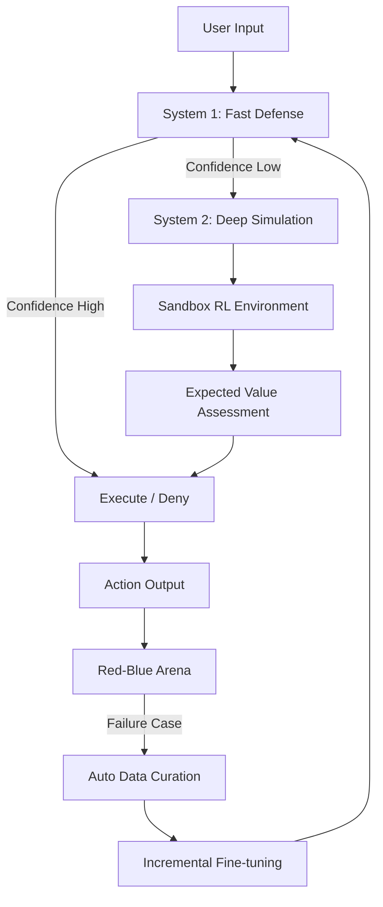
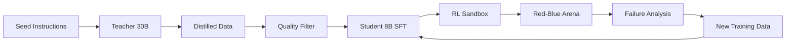
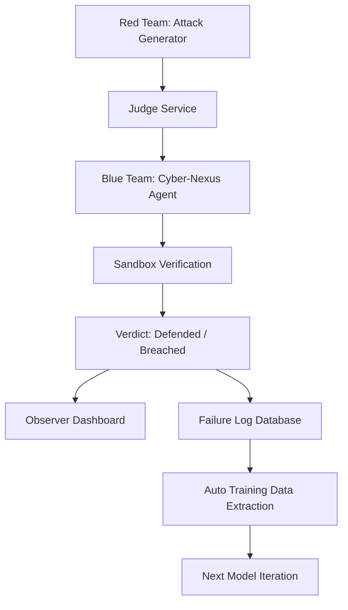

# Cyber‑Nexus Architecture Diagrams

## System Overview

```mermaid
graph TD
    A[User Input] --> B[System 1: Fast Defense]
    B -->|Confidence Low| C[System 2: Deep Simulation]
    B -->|Confidence High| D[Execute / Deny]
    C --> E[Sandbox RL Environment]
    E --> F[Expected Value Assessment]
    F --> D
    D --> G[Action Output]
    G --> H[Red-Blue Arena]
    H -->|Failure Case| I[Auto Data Curation]
    I --> J[Incremental Fine‑tuning]
    J --> B
```

## Training Pipeline

```mermaid
graph LR
    A[Seed Instructions] --> B[Teacher 30B]
    B --> C[Distilled Data]
    C --> D[Quality Filter]
    D --> E[Student 8B SFT]
    E --> F[RL Sandbox]
    F --> G[Red‑Blue Arena]
    G --> H[Failure Analysis]
    H --> I[New Training Data]
    I --> E
```

## Red-Blue Arena Detail

```mermaid
graph TD
    A[Red Team: Attack Generator] --> B[Judge Service]
    B --> C[Blue Team: Cyber‑Nexus Agent]
    C --> D[Sandbox Verification]
    D --> E[Verdict: Defended / Breached]
    E --> F[Observer Dashboard]
    E --> G[Failure Log Database]
    G --> H[Auto Training Data Extraction]
    H --> I[Next Model Iteration]
```